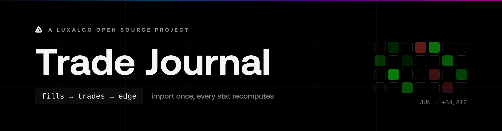
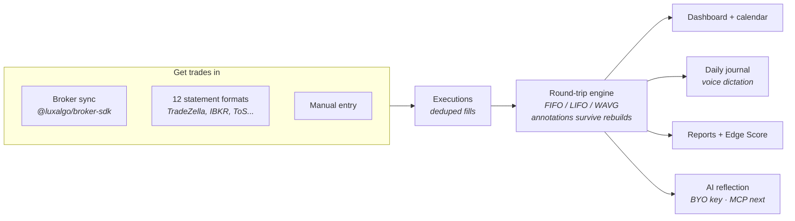

<div align="center">



<br/>

Broker sync, deep analytics, a P&L calendar, daily journaling with voice dictation, and AI reflection. All on your own machine.

Trade Journal is a [LuxAlgo](https://luxalgo.com) open-source project. Official repository: [github.com/LuxAlgo/trade-journal](https://github.com/LuxAlgo/trade-journal)

[](https://github.com/LuxAlgo/trade-journal/actions/workflows/ci.yml)
[](LICENSE)
[](packages/core/src/types.ts)
[](#quickstart)

[Quickstart](#quickstart) · [Features](#features) · [How it works](#how-it-works) · [Migrate](#migrating-from-tradezella-or-tradervue) · [Edge Score](docs/edge-score.md) · [Contributing](CONTRIBUTING.md)

</div>

---

**Record every trade. See what actually works.** Connect a broker or drop in a statement export, and Trade Journal rebuilds your history into round-trip trades, a P&L calendar, deep analytics, and a daily journal you can type, dictate, or ask questions of with your own AI. One command to run, and everything stays on your machine.


> ⚠️ **Early release.** APIs and schema may still move before 1.0. Statement parsers are cross-checked against real-world field sources; per-format status lives in [docs/importers.md](docs/importers.md).

## Quickstart

```bash
git clone https://github.com/LuxAlgo/trade-journal
cd trade-journal
pnpm install
pnpm dev
# http://localhost:3000
```

Requirements: Node 18.17+, pnpm. First run creates the SQLite database by itself. No migration tool, no setup wizard, no account.

### Docker

```bash
docker compose up -d
# http://localhost:3000, data persisted in the ./data volume
```

### Configuration (all optional)

| Env var             | Effect                                                                                      |
| ------------------- | ------------------------------------------------------------------------------------------- |
| `JOURNAL_PASSWORD`  | Require a password (it's your box, so auth is opt-in)                                       |
| `JOURNAL_SECRET`    | Encryption key source for credentials at rest (default: generated key file in the data dir) |
| `JOURNAL_DATA_DIR`  | Where the SQLite database lives (default `./data`)                                          |
| `ANTHROPIC_API_KEY` | AI features via env instead of the Settings page                                            |

Deploy anywhere a Node process and a persistent disk exist: Docker, Railway, Fly.io, a small VPS. Serverless platforms without a disk need an external database, which v0.1 does not support. SQLite on disk is the point.

## Why this exists

A trade journal is two things: a **verified record** of what you actually did, and the **reflection** that turns that record into better trading. Trade Journal keeps the record on your own machine and opens the reflection layer to any tool you choose, including your own AI.

- **Your keys never leave your box.** Broker credentials are AES-256-GCM encrypted next to your database. No cloud middleman. We don't want your keys.
- **Your numbers are auditable.** The [Edge Score](docs/edge-score.md) is a documented, versioned formula, not a proprietary black box. Every metric is open source and unit-tested.
- **Your journal is portable.** One-click JSON/CSV export of everything, always.

## How it works

One primitive drives everything: a raw **execution** (a fill). Executions come in from broker sync, statement imports, or manual entry; the round-trip engine turns them into trades; every surface reads from there.



## Features

|                          |                                                                                                                                                                                                                                                                       |
| ------------------------ | --------------------------------------------------------------------------------------------------------------------------------------------------------------------------------------------------------------------------------------------------------------------- |
| **Broker sync**          | Read-only sync via [`@luxalgo/broker-sdk`](https://github.com/LuxAlgo/broker-sdk): Alpaca, Binance, Bybit, Coinbase, Kraken, OKX, Tradier, IBKR Flex, Hyperliquid, Questrade, Topstep, Trading212, Webull, and more. Connect forms render straight from SDK metadata. |
| **Statement import**     | Auto-detected: **TradeZella** and **Tradervue** (one-click migration), TradingView, MetaTrader 4, ThinkorSwim, IBKR (activity + Flex), NinjaTrader, Tradovate, TopstepX, Webull, DAS Trader, plus a column mapper for any other CSV. Re-imports dedupe automatically. |
| **Round-trip engine**    | Flat-to-flat position cycles from raw fills. FIFO / LIFO / weighted-average per account. Partial fills, scale-ins, flips, futures multipliers. Annotations survive rebuilds.                                                                                          |
| **Analytics**            | Net/gross P&L, win and day-win rates, profit factor, expectancy, R multiples, streaks, drawdown and recovery, profit concentration, duration/time-of-day/weekday performance, per-symbol/tag/mistake/playbook breakdowns.                                             |
| **Dashboard**            | P&L calendar with weekly totals, cumulative and daily P&L, gauges, the open **Edge Score** radar, open positions, time-of-day performance.                                                                                                                            |
| **Trade pages**          | Charted on [Vela](https://www.npmjs.com/package/@luxalgo/vela) with entry/exit markers and P&L labels: real candles for crypto (keyless public data), honest fill-path rendering everywhere else. Running P&L, executions, ratings, stops/targets, tags, mistakes.    |
| **Daily journal**        | Day stats, intraday P&L curve, autosaving notes. Type them or **dictate** them (browser speech, zero keys, zero cost).                                                                                                                                                |
| **Notebook & playbooks** | Folders, search, tags; named setups with rule checklists, scored in Reports.                                                                                                                                                                                          |
| **AI reflection**        | Bring your own Anthropic API key: session recaps, per-trade critiques, "ask your journal" over your own aggregates. Key encrypted at rest; requests go from your server to the model, nowhere else.                                                                   |

## Migrating from TradeZella or Tradervue

Export your trades as CSV, drop the file on **Import → File upload**, done. Trade-level exports are reconstructed as entry/exit executions and your stated net P&L is preserved **to the cent**. Your history arrives agreeing with your old numbers.

## Monorepo layout

| Package                                    | What it is                                                                                                                        |
| ------------------------------------------ | --------------------------------------------------------------------------------------------------------------------------------- |
| [`packages/core`](packages/core)           | `@luxalgo/journal-core`: pure domain engine (round trips, metrics, calendar, Edge Score). No IO, no framework, fully unit-tested. |
| [`packages/importers`](packages/importers) | `@luxalgo/journal-importers`: statement parsers + migration importers. Zero-dependency CSV/HTML parsing.                          |
| [`apps/web`](apps/web)                     | The app: Next.js 15, SQLite (Drizzle), Tailwind, Recharts/ECharts, Vela charting, TanStack Table, ai-sdk.                         |

```bash
pnpm test          # unit tests (core + importers)
pnpm typecheck     # all packages
pnpm format:check  # prettier
pnpm build         # production build
```

## Roadmap

- **MCP server**: journal read/write tools so AI agents can journal for you and answer questions grounded in your real fills
- Real-export conformance fixtures per importer format (send yours: it is the most valuable PR this repo can receive)
- Postgres option for multi-device setups
- Playbook rule-adherence scoring

## Principles

MIT. No telemetry, ever. No hosted version that touches your keys. Sanctioned APIs only. The repo stands alone; LuxAlgo integrations are optional bridges, never dependencies.

## Disclaimer

Trade Journal reports and analyzes what your broker reports. Nothing it computes or generates (including AI recaps, critiques, and answers) is investment advice, and no metric predicts future results. Verify important numbers against your broker's own statements.

## License

Code is licensed under [MIT](LICENSE) © [LuxAlgo Global, LLC](https://luxalgo.com). The project name and LuxAlgo marks are covered by the [trademark policy](TRADEMARKS.md). Security reports: see [SECURITY.md](SECURITY.md).
